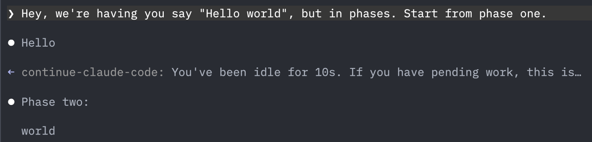

# continue-claude-code

This is a Claude Code plugin using [Channels](https://code.claude.com/docs/en/channels-reference) (Channels is currently in _Research Preview_ - April 2026). It tells Claude to get back to work after a configurable period of inactivity.

<p align="center"></p>

> **Note:** The implementation is fairly scuffed. It assumes it can get read permissions on session files and transcript timestamps in your home directory to figure out which session is active and whether it's idle. Having said that; it does work!

## What it does

`continue-claude-code` keeps track of Claude Code sessions through MCP connections. Combined with your local Claude Code session transcripts, it can make assumptions about which sessions are idle. Whenever Claude Code has been idle for long enough, it sends a notification through a Channel. This lets Claude continue without your intervention.

## FAQ

### When does it stop giving notifications?

It doesn't.

## Requirements

- Claude Code v2.1.80+
- `uv` and Python 3.11+

## Installation

```bash
claude plugin marketplace add Devleaps/marketplace
claude plugin install continue-claude-code@Devleaps-marketplace
```

Then enable channels in your organization settings (Teams/Enterprise admins only), and in your global `~/.claude/settings.json`:

```json
"channelsEnabled": true,
"allowedChannelPlugins": [
  {
    "marketplace": "Devleaps-marketplace",
    "plugin": "continue-claude-code"
  }
]
```

Start Claude Code with channels active:

```sh
claude --dangerously-load-development-channels plugin:continue-claude-code@Devleaps-marketplace
```

## Configuration

Via environment variables:

| Variable | Default | Description |
|----------|---------|-------------|
| `CONTINUE_CLAUDE_CODE_TIMEOUT` | `120` | Seconds of inactivity before a notification fires |

## License

[MIT](./LICENSE).
